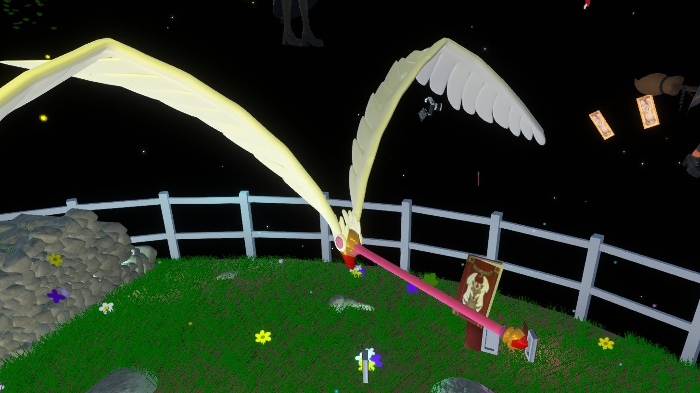

【カードキャプターさくら】VRでレリーズ!!できる封印の杖作ってみた【無料配布】

アニメ「カードキャプターさくら」をモチーフに、VR空間で“レリーズ!!”体験ができる封印の杖を作りました。入手から基本操作、封印・召喚、保存までの流れをまとめます。必ず相手への配慮と許可を得た上でお楽しみください。



## 配布リンク

    <noscript>
        
<a href="https://uni-pocket.com/ja/items/5bb56b3c-b7b5-44d9-9f57-c8139712781a">封印の杖（配布ページ）</a>

    </noscript>

## ① 杖の入手方法
- 「JP Public」→「MarkN(まーくん。)public」を入手
- フォルダ内の「おもちゃ」→「カードキャプターさくら」へ
- 中の「封印の杖（鍵の姿）」を取り出す

## ② 鍵から杖への変形

闇の力を秘めし鍵よ、真の姿を我の前に示せ 契約のもと、◯◯が命じる 封印解除（レリーズ）！

- 鍵を掴みながらトリガー（左クリック）を押す
- 鍵が手から離れ、自動で杖へ変形

## ③ 杖の基本操作
- 変形後の杖を掴む（VRは装備不要 / デスクトップはコンテキストメニューから「装備」）
- 杖を握った状態でトリガー（左クリック）で杖が回転

## ④ 他のユーザーをカードに封印（封印モード）

汝のあるべき姿に戻れ、クロウカード！

- セカンダリ（Rキー/スティック押し込み等）で「封印モード」ON/OFF
- 封印時のみモードONにするのが安全
- 封印モード中に杖の先端を相手に当てると封印
- 最重要: 封印は必ず相手の許可を得てから
- 封印されたユーザーはジャンプ（Space/スティック押し込み）で自力脱出可

## ⑤ 封印したカードの使い方
- 封印モードの杖でカードを叩くと、封印されたユーザーを召喚
- カードをインベントリに保存しても相手のユーザー/アバター情報は保存されません

## フライのカードの使い方
- 封印モードの杖で「フライ」のカードを叩くと、杖に羽が生え、乗れるようになります
- 杖にはアンカーが入っているので、レーザーを当ててトリガーで乗ることができます
- 左右のジョイスティックで空を自由に飛べます

## ⑥ 杖を鍵に戻して保存
- コンテキストメニューの「鍵モード」で杖→鍵に戻す
- 鍵モードではアイテム単体の保存不可
- 保存する場合は専用収納ケースやネックレスに装着して保存

## 制作風景

3DモデルはBlenderでフルスクラッチ 
ギミックはすべてResonite内でFluxやコンポーネントを使って実装しています

