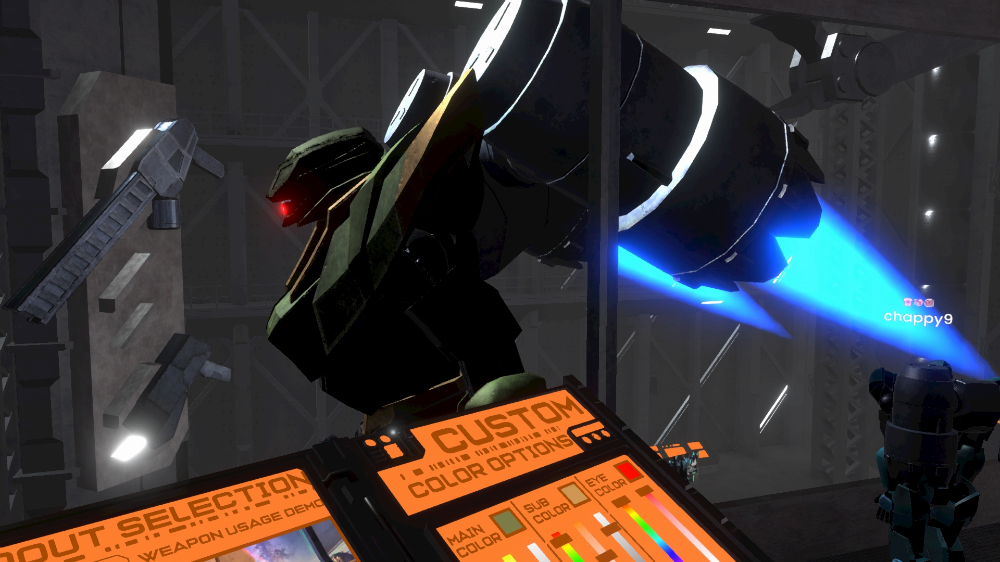

これはサンプル記事の**リード文**（導入文）です。この記事では、個別記事ページの基本的なレイアウトとMarkdown要素のスタイリングについて説明します。読みやすく、魅力的な記事ページを目指しましょう。

## 第1章: 見出しH2のスタイル

ここからが本文の始まりです。段落は適度な長さで改行し、読みやすさを意識します。Lorem ipsum dolor sit amet, consectetur adipiscing elit, sed do eiusmod tempor incididunt ut labore et dolore magna aliqua.

### 1.1. 見出しH3のスタイル

さらに細かいセクション分けにはH3を使用します。テキスト内の**太字**や*イタリック*も正しく表示されるか確認しましょう。 [これはサンプルリンクです](https://example.com)。

#### 1.1.1. 見出しH4のスタイル

H4はさらに細分化された内容に使います。

通常のテキストに続いて、リスト表示の確認です。

* 箇条書きリストのアイテム1
    * ネストされたアイテムA
    * ネストされたアイテムB
* 箇条書きリストのアイテム2
* 箇条書きリストのアイテム3

1.  番号付きリストのアイテム1
    1.  ネストされた番号付きアイテムA
    2.  ネストされた番号付きアイテムB
2.  番号付きリストのアイテム2
3.  番号付きリストのアイテム3

---

## 第2章: その他の要素

次は引用ブロックの表示テストです。

> これは引用ブロックです。他の情報源からの引用や、特に強調したいメッセージなどに使用します。
> The quick brown fox jumps over the lazy dog.


### 2.1. コードブロック

インラインの `code` スタイルも確認しましょう。

```html
<!DOCTYPE html>
<html lang="ja">
<head>
    <meta charset="UTF-8">
    <title>サンプルHTML</title>
</head>
<body>
    <h1>こんにちは</h1>
</body>
</html>
```

### 2.2. YouTube動画の埋め込みテスト

以下はショートコードを使って埋め込んだYouTube動画です。



### 2.3. 画像の表示

記事内の画像表示も重要です。

まずは標準のMarkdown構文で画像を表示してみます。


*これは標準Markdown画像の下に手動で書いたキャプションです。*

次に、Hugoの `figure` ショートコードを使ってキャプション付きで表示します。



### 便利なツールの紹介

以下は、私がよく利用するツールの一つです。

